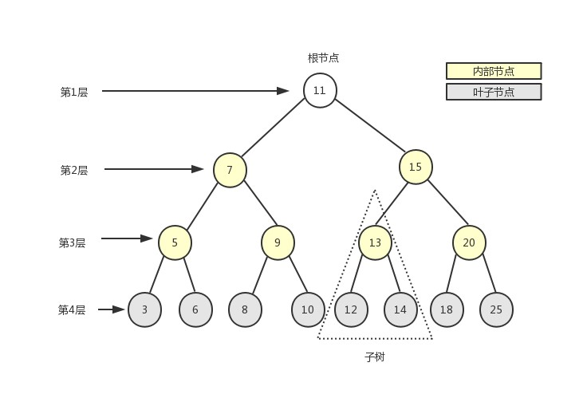
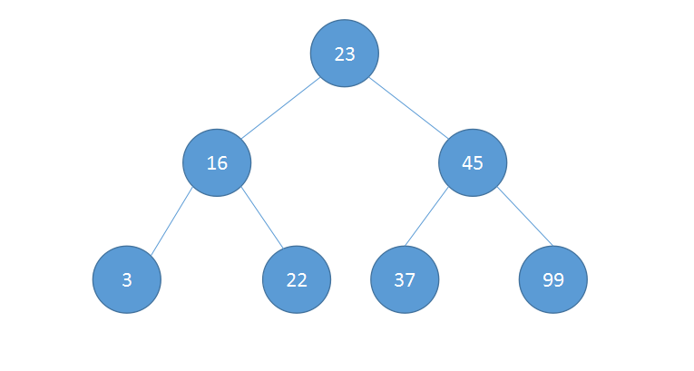
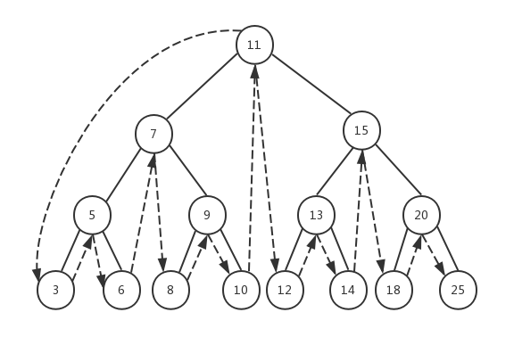
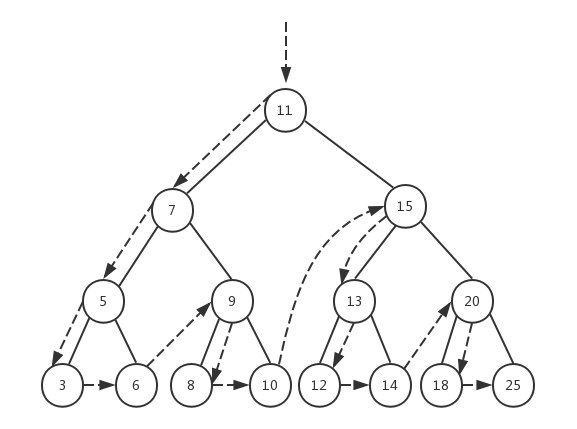
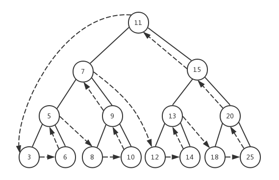
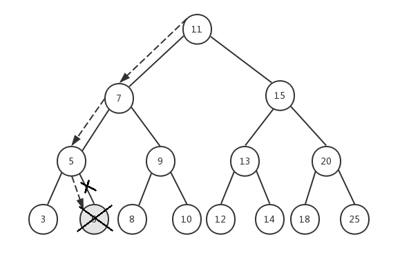
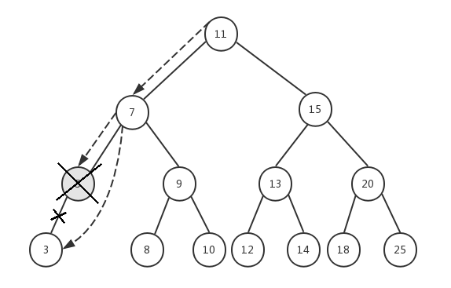
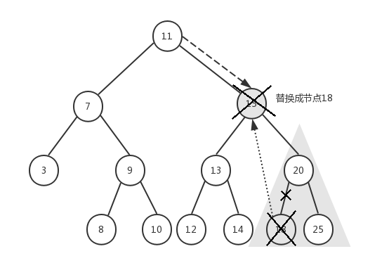
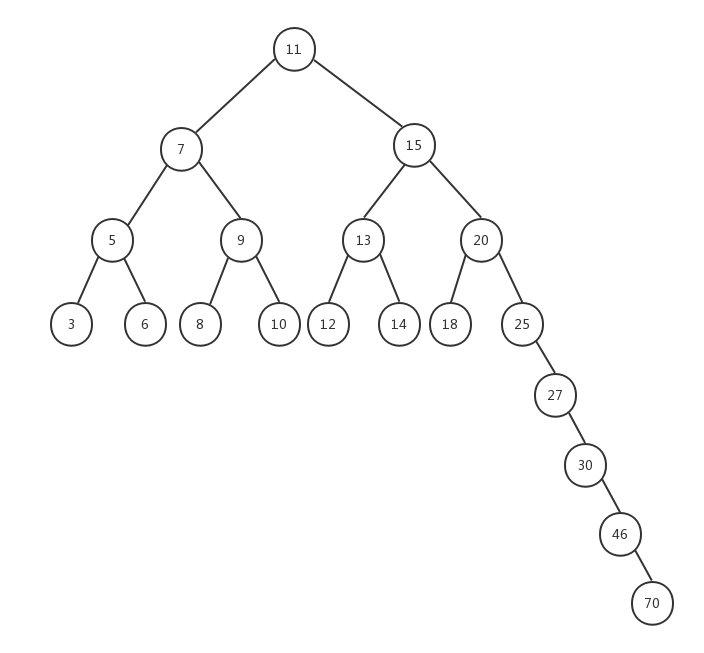

# 树(Tree)

`二叉树`中的节点最多只能有两个子节点：一个是左侧子节点，另一个是右侧子节点。这个定义有助于我们写出更高效地在树中插入、查找和删除节点的算法。二叉树在计算机科学中的应用非常广泛。


## 二叉搜索树(BST)

`二叉搜索树（BST）`是二叉树的一种，但是只允许你在左侧节点存储（比父节点）小的值，在右侧节点存储（比父节点）大的值。



这棵树中最多有两个分支, 因此是二叉树。

- `根节点`: 一棵树最顶部的节点
- `内部节点`: 在它上面还有其它内部节点或者叶节点的节点
- `叶节点`: 处于一棵树根部的节点
- `子树`: 由树中的内部节点和叶节点组成

首先就要定义一个Node类，用于存放树的节点，其构造与前面的链表类似。

```js
// 节点定义
function Node(key) {
    this.key = key
    this.left = null;
    this.right = null;
}
```

**添加新节点**

顶点为空则直接在该处插入, 若不为空, 则通过比较顶点的 key 和插入元素的 key 判断该插入到顶点的左侧还是右侧，后面进行如上递归
      
```js
function BinarySearchTree() {
    let root = null;
    // 插入
    this.insert = (key) => {
        const node = new Node(key)
        if (root == null) {     // 设值当前节点为根节点
            root = node
        } else {
            insertNode(root, node)
        }
        function insertNode(parent, node) {
            if (parent.key > node.key) {            // 当前节点大于新节点，则新节点放左边
                if (parent.left === null) {         // 若为空，则直接赋值为新节点, 出栈
                    parent.left = node
                } else {
                    insertNode(parent.left, node)   // 依次从根节点递归
                }
            } else if (parent.key < node.key) {     // 当前节点小于新节点，则新节点放右边
                if (parent.right === null) {
                    parent.right = node
                } else {
                    insertNode(parent.right, node)
                }
            }
        }
        return root
    } 
}
```
```js
const tree = new BinarySearchTree()

tree.insert(23)
tree.insert(45)
tree.insert(16)
tree.insert(37)
tree.insert(3)
tree.insert(99)
tree.insert(22)
```

上述插入数据后，会形成如下的二叉树




## 树的遍历

### 中序


中序遍历是一种以上行顺序访问BST所有节点的遍历方式，也就是以从最小到最大的顺序访问所有节点

中序遍历使用递归的方式最容易实现。该方法需要以升序访问树中所有节点，先访问左子树，再访问根节点，最后访问右子树



```js
// 中序遍历
this.inOrder = (cb) => {
    inOrder(root, cb)
    function inOrder(node, cb) {
        if (node) {
            inOrder(node.left, cb)
            cb(node.key)
            inOrder(node.right, cb)
        }
    }
}
```

中序遍历结果如下：

```js
let str = ''
let p = (val) => str += val + ' '

tree.inOrder(p)

console.log(str)
// 3 16 22 23 37 45 99
```

### 先序

先序遍历是以优先于后代节点的顺序访问每个节点的。

先序遍历和中序遍历的不同点是：先序遍历会先访问节点本身（1），然后再访问它的左侧子节点（2），最后是右侧子节点（3），而中序遍历的执行顺序是：{2}、{1}和{3}。




```js
// 先序遍历
this.preOrder = (cb) => {
    preOrder(root, cb)
    function preOrder(node, cb) {
        if (node) {
            cb(node.key)
            preOrder(node.left, cb)
            preOrder(node.right, cb)
        }
    }
}
```

先序遍历结果如下：

```js
tree.preOrder(p)
// 23 16 3 22 45 37 99 
```

### 后序

后序遍历会先访问左侧子节点（1），然后是右侧子节点（2），最后是父节点本身（3）。

你会发现，中序、先序和后序遍历的实现方式是很相似的，唯一不同的是行1、2和3的执行顺序。




```js
// 后序遍历
this.postOrder = (cb) => {
    postOrder(root, cb)
    function postOrder(node, cb) {
        if (node) {
            postOrder(node.left, cb)
            postOrder(node.right, cb)
            cb(node.key)
        }
    }
}
```

后序遍历结果如下：

```js
tree.postOrder(p)
// 3 22 16 37 99 45 23 
```

## 查找运算

### 最大值&最小值

遍历右子树，直到右子树的某个节点的 right 为 null 时，该节点保存的即为最大值

遍历左子树，直到左子树的某个节点的 left 为 null 时，该节点保存的即为最小值

```js
// 最大值：最右边
this.max = (node = root) => {
    let current = node
    while (current && current.right) {
        current = current.right
    }
    return current.key
}

// 最小值：最左边
this.min = (node = root) => {
    let current = node
    while (current && current.left) {
        current = current.left
    }
    return current.key
}
```

### 指定值

根据上面添加新节点可得知：当前节点小于新节点，则新节点放右边，反之放左边

查找的时候，根据key值进行判断，该往左右还是右边循环

```js
// 查找指定值
this.search = (key) => {
    if (root == null) {
        return null
    }
    let current = root
    while (current) {
        if (current.key === key) {
            return current
        } else if (current.key < key) {
            current = current.right
        } else {
            current = current.left
        }
    }
}
```

```js
console.log(tree.search(100))   // Node {key: 100, left: Node, right: null}
console.log(tree.search(111))   // undefined
```

## 删除节点

从BST上删除节点的操作最复杂，其复杂程度取决于删除哪个节点。

如果删除没有子节点的节点，那么非常简单。

如果节点只有一个子节点，不管是左子节点还是右子节点，就变得稍微有点复杂了。

删除包含两个子节点的节点最复杂。

```js
this.remove = (key) => {
    const removeNode = (node, key) => {
        if (node == null) return null

        if (key == node.key) {
            if (node.left == null && node.right == null) {  // 没有子节点
                node = null
                return node
            } 
            else if (node.left == null) {                 // 有右子节点
                node = node.right
                return node
            } 
            else if (node.right == null) {                // 有左子节点
                node = right.left
                return node
            }

            // 包含两个子节点
            let min = this.min(node.right)
            node.key = min.key
            node.right = removeNode(node.right, min.key)
            return node

        } else if (key < node.key) {    // 小于节点，往左边
            node.left = removeNode(node.left, key)
            return node
        } else {                        // 大于节点，往右
            node.right = removeNode(node.right, key)
            return node
        }
    }
    removeNode(root, key)
}
```

首先要找到树中待删除的节点，这需要进行递归遍历，从根节点开始

如果key值小于当前节点的值，则遍历左子树，如果key值大于当前节点的值，则遍历右子树。

注意，在递归遍历的过程中，我们将node（这里的node传入的是树的根节点）的`left`指针或`right`指针逐级指向下一级节点，然后返回整个node。

当找到要删除的节点后，我们要处理三种情况：

```js
// 先赋值 与图片一致的树
tree.insert(11);
tree.insert(7);
tree.insert(15);
tree.insert(5);
tree.insert(9);
tree.insert(13);
tree.insert(20);
tree.insert(3);
tree.insert(6);
tree.insert(8);
tree.insert(10);
tree.insert(12);
tree.insert(14);
tree.insert(18);
tree.insert(25);
```

### 没有子节点



假设我们要删除节点6，传入根节点11，整个执行过程如下：

1. node=11，key=6，6<11，递归执行`removeNode(7, 6)`
2. node=7，key=6，6<7，递归执行`removeNode(5, 6)`
3. node=5，key=6，6>5，递归执行`removeNode(6, 6)`
4. node=6，key=6，6=6，并且节点6的`left`和`right`都为`null`, 所以我们将节点6设置为`null`，并且返回`null`
5. 递归返回到步骤3，节点5的`right`将获取步骤4的返回值null
6. 递归返回到步骤2，节点7的`left`依然指向节点5，保持不变
7. 递归返回到步骤1，节点11的`left`依然指向节点7，保持不变
8. 最后返回节点11

### 一个子节点



前面已经删除了节点6，假设我们现在要删除节点5，它有一个左子节点3，我们依然传入根节点11，来看看整个执行过程：

1. node=11，key=5，5<11，递归执行`removeNode(7, 5)`
2. node=7，key=5，5<7，递归执行`removeNode(5, 5)`
3. node=5，key=5，5=5，并且节点5的`left=3`，`right=null`，所以我们将节点5替换成它的左子节点3，并返回节点3
4. 递归返回到步骤2，节点7的`right`将获取步骤3的返回值3
5. 递归返回到步骤1，节点11的`left`依然指向节点7，保持不变
6. 最后返回节点11

### 左右子节点



前面已经删除了节点6和节点5，现在我们要删除节点15，它有左右子树，我们传入根节点11，来看下具体执行过程：

1. node=11，key=15，15>11，递归执行`removeNode(15, 15)`
2. node=15，key=15，15=15
    - 进入包含两个子节点的判断条件里
    - 此时我们需要**找到节点15**的右子树中的`最小节点18`
    - 将节点15的key替换成节点18的key
    - 将节点15的`right`节点（即节点20）作为起始节点进行遍历，找到并删除节点18
    - 最后再将节点15（此时它的key是18）的`right`指针指向节点20，并返回节点15
3. 递归返回到步骤1，节点11的`right`依然指向节点15，但此时节点15的key已经变成18了
4. 最后返回节点11

**OK**

解决上面右子树的最小节点的疑问, 为什么要找到这个最小节点呢??

试想一下，当删除节点15之后，为了保证我们的二叉搜索树结构稳定，必须用节点15的右子树中的最小节点来替换节点15，如果直接将11的next指向20，则20将会有三个子节点13、18、25，这显然已经不符合我们二叉树的定义了。如果将节点25用来替换节点15，节点20的值比节点25的值小，不应该出现在右子节点，这也不符合我们的二叉搜索树的定义。

所以，只有按照上述过程才能既保证不破坏树的结构，又能删除节点。

注: **(右子节点的最小值 or 左子节点的最大值)** 两则皆可, 任选其一, 神奇的二叉树


## 自平衡树

上面的BST树（二叉搜索树）存在一个问题，树的一条边可能会非常深，而其它边却只有几层，这会在这条很深的分支上添加、移除和搜索节点时引起一些性能问题。

如下图所示：



```js
class AVLTree extends BinarySearchTree {
    constructor() {
        super()
    }

    // LL旋转: 向右旋转
    rotationLL(node) {
        let tmp = node.left
        node.left = tmp.right
        tmp.right = node
        return tmp
    }
    
    // RR旋转: 向左旋转
    rotationRR(node) {
        let tmp = node.right;
        node.right = tmp.left;
        tmp.left = node;
        return tmp;
    }

    // LR旋转: 先向左旋转，然后再向右旋转
    rotationLR(node) {
        node.left = this.rotationRR(node.left);
        return this.rotationLL(node);
    }

    // RL旋转: 先向右旋转，然后再向左旋转
    rotationRL(node) {
        node.right = this.rotationLL(node.right);
        return this.rotationRR(node);
    }
    getNodeHeight(node = this.root) {
        if (node == null) {
            return 0
        } else {
            let left = this.getNodeHeight(node.left)
            let right = this.getNodeHeight(node.right)
            return Math.max(left, right) + 1
        }
    }

    insertNode(key) {
        this.insert(key)
        
        // 左子树高度大于右子树高度
        if (this.getNodeHeight(this.root.left) - this.getNodeHeight(this.root.right) > 1) {
            if (key < this.root.left.element) {
                this.root = this.rotationLL(this.root)
            } else {
                this.root = this.rotationLR(this.root)
            }
        }
        // 右子树高度大于左子树高度 
        else if (this.getNodeHeight(this.root.right) - this.getNodeHeight(this.root.left) > 1) {
            if (key > this.root.right.element) {
                this.root = this.rotationRR(this.root)
            } else {
                this.root = this.rotationRL(this.root)
            }
        }
    }

    removeNode(key) {
        this.remove(key)
        
        // 左子树高度大于右子树高度
        if (this.getNodeHeight(this.root.left) - this.getNodeHeight(this.root.right) > 1) {
            if (key < this.root.left.element) {
                this.root = this.rotationLL(this.root)
            } else {
                this.root = this.rotationLR(this.root)
            }
        }
        // 右子树高度大于左子树高度 
        else if (this.getNodeHeight(this.root.right) - this.getNodeHeight(this.root.left) > 1) {
            if (key > this.root.right.element) {
                this.root = this.rotationRR(this.root)
            } else {
                this.root = this.rotationRL(this.root)
            }
        }
    }
}
```

对于LL旋转和RR旋转，我们可以按照上面的示意图来看下执行过程。

LL旋转，node=11，node.prev是7，所以tmp=7。然后将node.prev指向tmp.next，即将11的prev指向9。接着将tmp.next指向node，即将7的next指向11。即完成了图中所示的旋转。

RR旋转，node=11，node.next是15，所以tmp=15。然后将node.next指向tmp.prev，即将11的next指向13。接着将tmp.prev指向node，即将15的prev指向11。即完成了图中所示的旋转。

```js
const trees = new AVLTree()

trees.insertNode(11);
trees.insertNode(7);
trees.insertNode(15);
trees.insertNode(5);
trees.insertNode(9);
trees.insertNode(8);

trees.preOrder((value) => console.log(value));

// 9 7 5 8 11 15
```

LR旋转是RR旋转和LL旋转的组合：


```js
const trees = new AVLTree()

trees.insertNode(11);
trees.insertNode(7);
trees.insertNode(15);
trees.insertNode(13);
trees.insertNode(20);
trees.insertNode(14);

trees.preOrder((value) => console.log(value));

// 13 11 7 15 14 20
```

RL旋转是LL旋转和RR旋转的组合：


