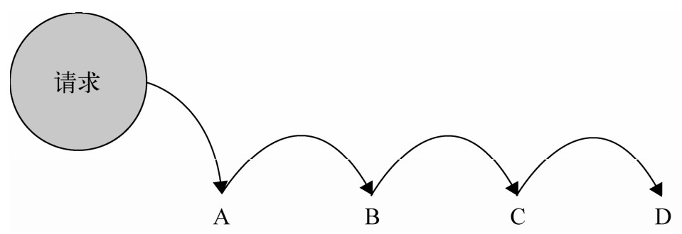

# 职责链模式

> 使多个对象都有机会处理请求，从而避免请求的发送者和接收者之间的耦合关系，将这些对象连成一条链，并沿着这条链传递该请求，直到有一个对象处理它为止。



**优点**

1. 解耦了请求发送者和度个接收者之间的复杂关系，不需要知道链中哪个节点能处理你的请求，只需要把请求传递到第一个节点即可。
2. 链中的节点对象可以灵活地拆分重组，增加或删除一个节点，或者改变节点的位置都是很简单的事情。
3. 我们还可以手动指定节点的起始位置，并不是说非得要从其实节点开始传递的.


**缺点**

职责链模式使得程序中多了一些节点对象，可能在某一次的请求传递过程中，大部分节点并没有起到实质性的作用，它们的作用仅仅是让请求传递下去，从性能方面考虑，我们要避免过长的职责链带来的性能损耗。

## Demo

来用一个`demo`理解，职责链的目的与实现：

场景：某电商针对已付过定金的用户有优惠政策，在正式购买后，已经支付过 500 元定金的用户会收到 100 元的优惠券，200 元定金的用户可以收到 50 元优惠券，没有支付过定金的用户只能正常购买。

```js
// orderType：订单类型
// pay：是否已支付定金
// stock：手机库存数量

// 500元订单
const order = (orderType, pay, stock) => {
    if (orderType === 1) {  // 500元定金预购模式
        if (pay === true) { // 已付定金
            console.log('500元定金预购，得到100优惠券')
        } else {            // 未付定金，降级为普通购买
            if (stock > 0) {
                console.log('普通购买，无优惠券')
            } else {
                console.log('手机库存不足')
            }
        }
    } 
    else if (orderType === 2) {
        if (pay === true) {
            console.log('200元定金预购，得到100优惠券')
        } else {
            if (stock > 0) {
                console.log('普通购买，无优惠券')
            } else {
                console.log('手机库存不足')
            }
        }
    }
    else if (orderType === 3) {
        if (stock > 0) {
            console.log('普通购买，无优惠券')
        } else {
            console.log('手机库存不足')
        }
    }
}

order(1, true, 500)  // 500元定金预购，得到100优惠券
```

`order`函数不仅巨大到难以阅读，而且需要经常进行修改。

## 职责链实现

```js
// 500元订单
const order500 = (orderType, pay, stock) => {
    if (orderType === 1 && pay == true) {
        console.log('500元定金预购，得到100优惠券')
    } else {
        order200(orderType, pay, stock)
    }
}

// 200元订单
const order200 = (orderType, pay, stock) => {
    if (orderType === 2 && pay == true) {
        console.log('200元定金预购，得到100优惠券')
    } else {
        orderNormal(orderType, pay, stock)
    }
}

// 普通购买
const orderNormal = (orderType, pay, stock) => {
    if (orderType === 3 && stock > 0) {
        console.log('普通购买，无优惠券')
    } else {
        console.log('手机库存不足')
    }
}

// 测试结果
order500(1, true, 500)  // 500元定金预购，得到100优惠券
order500(1, false, 500) // 普通购买，无优惠券
order500(2, true, 500)  // 200元定金预购，得到100优惠券
order500(3, false, 500) // 普通购买，无优惠券
order500(3, false, 0)   // 手机库存不足
```

改造后可以发现代码相对清晰了，但是链路代码和业务代码依然耦合在一起，进一步优化：

## 优化链路

```js
const order500 = (orderType, pay, stock) => {
    if (orderType === 1 && pay == true) {
        console.log('500元定金预购，得到100优惠券')
    } else {
        return 'nextSuccessor'  // 下一个节点
    }
}

// 200元订单
const order200 = (orderType, pay, stock) => {
    if (orderType === 2 && pay == true) {
        console.log('200元定金预购，得到100优惠券')
    } else {
        return 'nextSuccessor'
    }
}

// 普通购买
const orderNormal = (orderType, pay, stock) => {
    if (orderType === 3 && stock > 0) {
        console.log('普通购买，无优惠券')
    } else {
        console.log('手机库存不足')
    }
}

// 具体相当于链表
class Chain {
    constructor(fn) {
        this.fn = fn
        this.successor = null
    }
    // 指定链中的下一个节点
    setNext = function(successor) {
        return this.successor = successor
    } 
    // 返回结果或进入下一个节点
    init = function() {
        const ret = this.fn.apply(null, arguments)
        if (ret === 'nextSuccessor') {
            return this.successor && this.successor.init.apply(this.successor, arguments)
        }
        return ret
    }
}

// 把订单函数包装成职责链的节点
const chainOrder500 = new Chain(order500)
const chainOrder200 = new Chain(order200)
const chainOrderNormal = new Chain(orderNormal)

// 指定节点在职责链中的顺序
chainOrder500.setNext(chainOrder200)
chainOrder200.setNext(chainOrderNormal)

// 最后，只需调用第一个节点
chainOrder500.init(1, true, 500)  // 500元定金预购，得到100优惠券
chainOrder500.init(1, false, 500) // 普通购买，无优惠券
chainOrder500.init(2, true, 500)  // 200元定金预购，得到100优惠券
chainOrder500.init(3, false, 500) // 普通购买，无优惠券
chainOrder500.init(3, false, 0)   // 手机库存不足
```

其实就是一个链表，往下一级一级走，直到目标一致的节点。

重构后，链路代码和业务代码彻底地分离。假如未来需要新增 `order300`，那只需新增与其相关的函数而不必改动原有业务代码。

```js
const order300 = () => {
    // ...
}
const chainOrder300 = new Chain(order300)

chainOrder500.setNext(chainOrder300)
chainOrder300.setNext(chainOrder200)
```


## 用AOP实现

在之前的职责链实现中，我们利用了一个`Chain`类来把普通函数包装成职责链的节点。

其实是利用JavaScript的函数式特性，有一种更加方便的方法来创建职责链：

```js
const order500 = (orderType, pay, stock) => {
    if (orderType === 1 && pay == true) {
        console.log('500元定金预购，得到100优惠券')
    } else {
        return 'nextSuccessor'  // 下一个节点
    }
}
const order200 = (orderType, pay, stock) => {
    if (orderType === 2 && pay == true) {
        console.log('200元定金预购，得到100优惠券')
    } else {
        return 'nextSuccessor'
    }
}
const orderNormal = (orderType, pay, stock) => {
    if (orderType === 3 && stock > 0) {
        console.log('普通购买，无优惠券')
    } else {
        console.log('手机库存不足')
    }
}

// 函数原型增加方法
Function.prototype.after = function(fn){
    let self = this;
    return function() {
        let ret = self.apply(this, arguments)
        if (ret === 'nextSuccessor') {
            return fn.apply(this, arguments)
        }
        return ret
    }
}

const order = order500.after(order200).after(orderNormal)

order(1, true, 500)  // 500元定金预购，得到100优惠券
order(1, false, 500) // 普通购买，无优惠券
order(2, true, 500)  // 200元定金预购，得到100优惠券
order(3, false, 500) // 普通购买，无优惠券
order(3, false, 0)   // 手机库存不足
```

用AOP来实现职责链既简单又巧妙，但这种把函数叠在一起的方式，同时也叠加了函数的作用域。

**如果链条太长的话，也会对性能有较大的影响。**