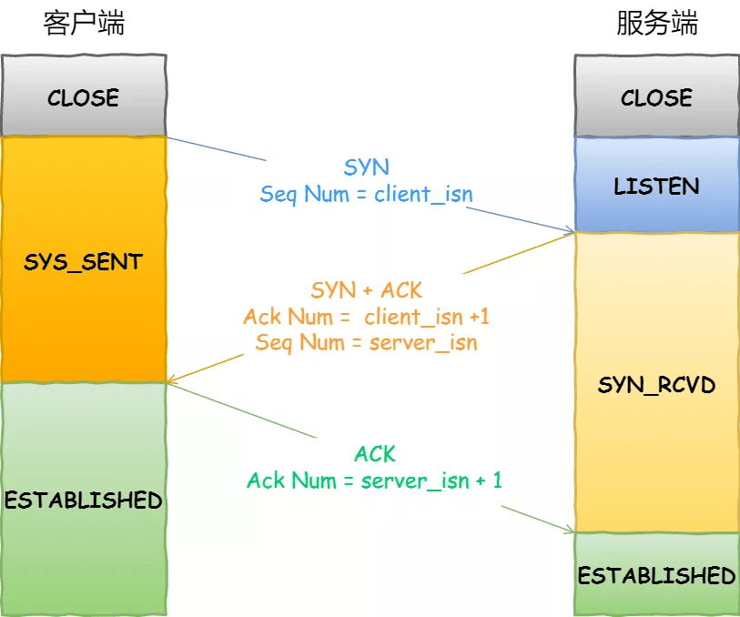

# TCP三次握手和四次挥手

建立TCP链接是为了保证稳定有序的收发数据，那么就要保证双方的`发送能力`和`接收能力`都是OK的。 

- FIN = finish
- ACK = acknowledge

## 三次握手

三次握手之所以三次，是保证`client`和`server`都要让 **"对方"** 知道自己`发送能力`和`接收能力`都OK的最小次数。

> `client => server` server判断出client具备发送能力
>
> `server => client` client可以判断出server具备发送和接收能力
>
> `client => server` client还需让server知道自己接收能力没问题

- 客户端：我准备好了，你准备好了么，收到请回答？ 
- 服务端：我收到了，我也准备好了，你收到了么？ 
- 客户端：我也收到了

双方均保证了自己的接收和发送能力没有问题

TCP连接建立，两次不安全，四次浪费资源，三次刚刚好。

从最开始双方都处于`CLOSED`状态。然后服务端开始监听某个端口，进入了`LISTEN`状态。

- 第一次握手

客户端主动发起连接，发送`SYN`, 发送完毕后，客户端进入`SYN-SENT`状态。

- 第二次握手

服务端接收到，返回`SYN和ACK`(对应客户端发来的SYN)，发送完毕后，服务器端进入`SYN_RCVD`状态。

- 第三次握手

客户端再发送`ACK`给服务端，发送完毕后，客户端进入`ESTABLISHED`状态；服务端收到ACK之后，也进入`ESTABLISHED`状态，TCP 握手结束。

## 四次挥手

> `client => server` client请求关闭连接，发送FIN到server
>
> `server => client` server接收关闭连接请求，发送ACK进行最后数据传输
>
> `server => client` server向client发送可以进行关闭连接的请求FIN
>
> `client => server` client接收请求，发送确认关闭ACK，等待2msl后关闭

- 学生：老师，下课了
- 老师：好了，我知道，还有一部分没讲完
- 老师：讲完了，下课
- 学生：好的

四次挥手后，client和server成功地断开了连接~

刚开始双方处于`ESTABLISHED`状态。

- 第一次挥手

客户端想要关闭连接，向服务器发送`FIN`报文，发送完毕后，客户端进入`FIN_WAIT_1`状态。

- 第二次挥手

服务端收到该`FIN`报文后，就向客户端发送`ACK`应答报文，接着服务端进入`CLOSED_WAIT`状态。

客户端接收到服务端的`ACK`应答报文后，进入`FIN_WAIT_2`状态。

- 第三次挥手

服务端处理完数据后，向客户端发送`FIN`报文，发送完毕后，服务器端进入`LAST_ACK`状态。

- 第四次挥手

客户端接收到来自服务端的`FIN`报文后，回一个`ACK`应答报文，并进入`TIME_WAIT`状态。

服务端接收到这个确认包之后，关闭连接，进入`CLOSED`状态，至此**服务端已经完成连接的关闭**。

客户端等待了`2MSL`之后，自动进入`CLOSED`状态，**至此客户端也完成连接的关闭**。

## 参考

- [谈谈你对 TCP 三次握手和四次挥手的理解](https://github.com/Advanced-Frontend/Daily-Interview-Question/issues/15)
- [【面试】图解 TCP 常见面试题！](https://mp.weixin.qq.com/s/2cQI_mfNsXElStHeuR9LmA)